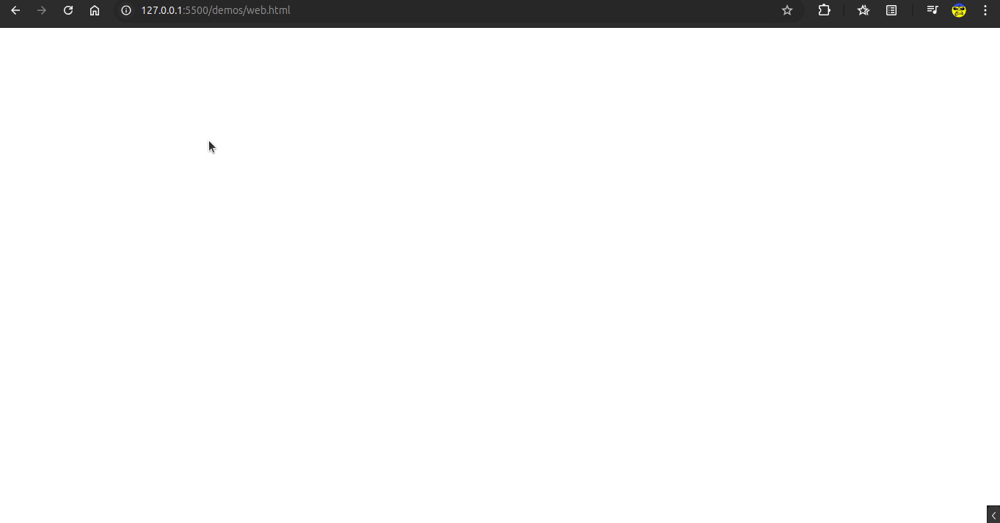

Solution for [Spaghetti code contest](https://robotdreams.cc/uk/course/1645-konkurs-na-naykrashchiy-laynokod-ukrajini) from robot_dreams

## Task

Generate a random number between 1 and 100.
The solution should be a single line of code containing no more that 1000 characters.

## Solution

- Language: JavaScript;
- Path: [getRandomNumberFrom1To100.js](getRandomNumberFrom1To100.js).

## Instruction for running the solution in a web browser

1. Include [getRandomNumberFrom1To100.js](getRandomNumberFrom1To100.js) script into your web page.
2. Use `getRandomNumberFrom1To100()` function in your scripts or web browser console.

## Instruction for running the solution in node.js environment

1. Import [getRandomNumberFrom1To100.js](getRandomNumberFrom1To100.js) script into your one.
2. Use `getRandomNumberFrom1To100()` function in your script.

## Demos

- [Web](demos/web.html)
  
- [Node.js](demos/node.mjs)
  
